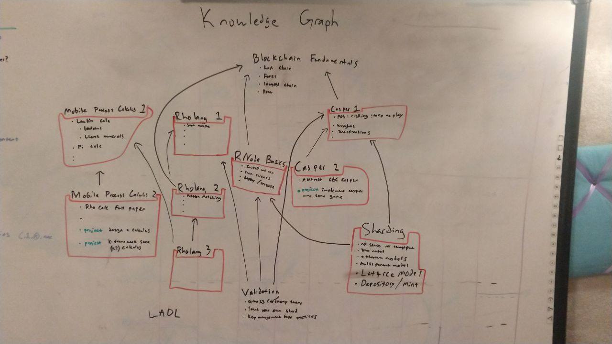
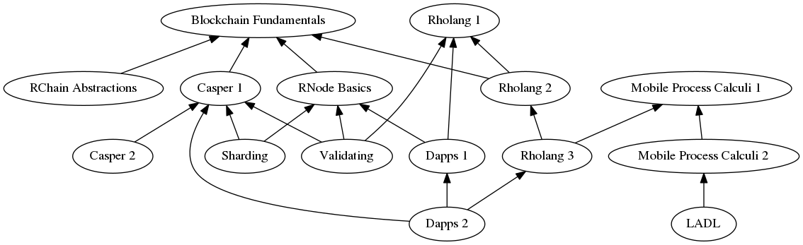

# E-Learning project

## Goals

Have a complete RChain fundamentals e-learning course on a few major platforms by March 2019.

## Learning Paths

Learners can choose their own path to a desired micro-certification(s). Allow Skip testing by auto-graded tests.  We will focus on the following major Learning Paths and Outcomes:

### Learning Path 1 - Technology Decision Maker

**Audience**: Managers, Entepreneurs, Investors, and Tech Evangelists \
**Outcomes**: 
 1. Understand how each generation of blockchains builds on the previous ones
 2. Describe the problems 3rd generation blockchains are solving
 3. List several 3rd generation blockchains, and what makes RChain unique
 4. Understand how RChain operating costs are calculated, and some mitigation tactics
 5. Familiar with the terms Casper, PoS, Sharding, and Validating and how they are related
 6. Describe Rholang key concepts of UnforgeableNames, Processes, and Par
 7. List several dApp integration strategies for building with RChain
 8. Familiar with the requirements for running RNode infrastructure

### Learning Path 2 - dApp Developer

**Audience**: Software Engineers, IT Architects, Blockchain Consultants \
**Outcomes**:
 1. Describe all RChain key concepts
 2. Setup, run, and update a local RNode instance
 3. Demonstrate the iterative Rholang development process
 4. Develop SmartContracts using Rholang that are maximally scalable
 5. Demonstrate tactics for SmartContract communication between Shards
 6. Understand 'object capability' (ocap) concepts and how to apply them
 7. Understand how RChain operating costs are calculated, and some mitigation tactics
 8. List several dApp integration strategies for building with RChain
 9. Create a full-stack application that integrates with RNode and Rholang

### Learning Path 3 - Node Operator / Validator

**Audience**: Network Engineer, Cloud Architect, Data Architect, SRE \
**Outcomes**:
 1. Setup, run, and update a local RNode instance
 2. Familiar with common networking issues when deploying an RNode instance
 3. Describe the process of sizing infrastructure for different requriements
 4. Demonstrate the process of Bonding, Staking, and Syncing a Shard
 5. List the types of Equivocations and their consequences
 6. List the steps required to deploy SmartContracts
 7. Understand tactics for securely managing private keys on the server
 8. Identify solutions for monitoring network operations and performance
 9. Demonstrate running RNode in docker and automating log analysis

## Knowledge Graph

To generate this graph run `dot -Tpng knowledge-graph.dot > knowledge-graph.png`

### Block Chain Fundamentals
We won't cover this material until later or never
* Hash Chain
* Forks
* Longest Chain
* Proof of Work

### RChain Introduction
* 1st-gen >> 2nd-gen >> 3rd-gen blockchains - where are we heading?
* More trans/sec than Visa - concurrent by design
* More storage capacity than Facebook - storage scaling on demand (sharding)
* More secure than other SmartContract languages - mathematically provable functionality
* More cost effective than other Public blockchains - validate your own shard
* Comparing 1st-2nd-3rd-gen blockchains (BitCoin vs Ethereum vs RChain)
* Comparing Public 3rd-gen blockchains (Cordano vs EOS vs ArcBlock vs RChain)
* Comparing Operating Costs (Ethereum vs Cordano vs EOS vs RChain)

### RChain Concepts
* RSpace - Data Storage
* Casper - Consensus using PoS
* Namespaces - Sharding strategy
* UnforgeableNames - Secure SmartContract references
* Par - Concurrent Execution
* Signatures - 2 choices
* Hashes - 3 choices
* Registry - Lookup service between UnforgebleName <==> UUID
* Wallets & Purses - No central list of accounts
* REV & Phlogiston - RChain token and paying for computation
* Rho Calculus - All data is in-motion, all the time, at the same time

### Rholang 1
* Dev Environment setup (which one? Cryptofex vs RNode vs Docker)
* Printing to the screen (`stdout`) - Hello, World!
* Defining data storage using `new` - Introducing `names`
* Storing variable data - Introducing `processes`
* Everything is happening in parallel - Introducing `|`
* Data is always in motion - Introducing `for`
* Converting between 'names' and 'processes' - Using `@` and `*` prefixes
* Creating loops using `for` with sends and receives
* Making decisions using `if - else` statements
* Comparing variable data - (==, <, >, >=, <=, and, or, not)
* Defining a Contract - Passing in values and receiving a response
* Slowing things down - Running tasks in order using `stdoutAck` callbacks
* **Project:** Create the `countToTenByTwos` contract

### Rholang 2
* Pattern matching
* Bundles
* Data structures
* Recursion
* **Project:** Implement makeMint-style token

### Rholang 3
* Advanced pattern matching
* **Project:** Implement merge sort or some other similarly interesting algorithm

### RNode Basics
* Install and run RNode
* Use thin clients
* deploy and propose blocks

### Validating
* Genesis Ceremony Theory
* Practice of bootstrapping own network
* Key management best practices
* Ecomonics

### Casper 1
* Proof of Stake and wagering to play
* Validator weights
* Justifications
* Fork choice rule
* Equivocations

### Casper 2
* Abstract CBC Casper
* **Project:** implement casper over some game (eg. chess)

### Sharding
* n times shards, n times throughput
* RChain's tree model
* Depository / Mint
* Ethereum's attempts
* Multi-parent model
* Old Lattice model / namespaces

### Dapps 1
* Nth caller example
* Using RChain-API and RSign
* Name registry
* **Project:** Build a mineable coin like 0xbitcoin

### Dapps 2
* Cost model
* Phlogiston dimensions
* **Project:** Make your own REV:alt order book.

### #Mobile Process Calculi 1
* Lambda Calculus
  * Booleans
  * Church Numerals
* Pi Calculus

### Mobile Process Calculi 2
* Rho Calc Paper
*
* **Project:** Design your own calculus
* **Project:** Implement pi calculus in k-framework

### LADL
* Modal Logic
* Category theory

### Capstone Credential
* Minimum number / score of microcerts?
* Individual final project?
* Exam?
